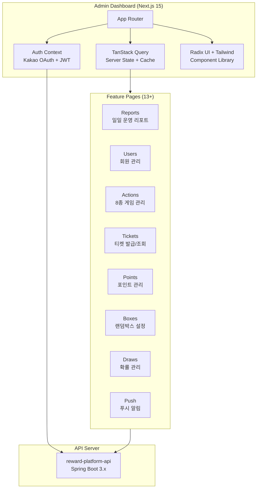

# Game Reward Platform Admin Dashboard


게임 리워드 플랫폼의 **운영 어드민 대시보드**입니다.
[reward-platform-api](https://github.com/HellCoding/reward-platform-api) 백엔드와 연동하여
사용자, 게임, 포인트, 티켓, 광고, 푸시 알림 등을 관리합니다.

## Why This Project?

| 요구사항 | 구현 |
|---------|------|
| 실시간 운영 모니터링 | **Recharts** 기반 일일 리포트 대시보드 |
| 10개+ 도메인 CRUD | **TanStack Query** 서버 상태 관리 + 캐싱 |
| 다크 모드 지원 | **next-themes** + HSL CSS 변수 |
| 접근 제어 | **Kakao OAuth** + JWT + Role-based Access |
| 운영 안전성 | **Read-Only Mode** (프로덕션 쓰기 방지) |
| 확률 관리 | 실시간 확률 에디터 (합계 100% 자동 검증) |

## Architecture



## Key Features

### 1. 일일 운영 리포트

Recharts 기반 데이터 시각화로 **사용자, 게임, 포인트, 광고 KPI**를 모니터링합니다.

- 탭별 카테고리 분리 (사용자, 티켓, 포인트, 박스, 추첨, 포인트몰, 타임미션)
- 날짜별 이력 추적
- 통계 카드 + 차트 조합 레이아웃

### 2. TanStack Query 서버 상태 관리

```typescript
// 모든 API 호출을 TanStack Query로 관리
// → 자동 캐싱, stale 데이터 감지, 리패칭, 로딩/에러 상태
const { data, isLoading, error } = useQuery({
  queryKey: ['users', page, filter],
  queryFn: () => userService.getUsers(page, filter),
});
```

### 3. Kakao OAuth + JWT 인증

```
Login Flow:
├─ Kakao OAuth 로그인 (카카오 SDK)
├─ Authorization Code → 백엔드 전달
├─ JWT Access Token + Refresh Token 발급
├─ Axios Interceptor에서 자동 토큰 갱신
│   ├─ 401 → refreshToken 요청
│   ├─ 대기 중인 요청 큐잉 (동시 갱신 방지)
│   └─ 갱신 실패 → 로그인 페이지 리다이렉트
└─ Role 검증 (ADMIN / SUPER_ADMIN)
```

### 4. Read-Only Mode (운영 안전장치)

프로덕션 환경에서 실수로 데이터를 변경하지 않도록 **쓰기 작업을 차단**합니다.

- **API 레벨**: Axios Interceptor에서 POST/PUT/PATCH/DELETE 요청 차단
- **UI 레벨**: 상단 배너 + 사이드바 뱃지로 시각적 표시
- **환경 기반**: `READ_ONLY_MODE=true` (프로덕션 기본값)

### 5. 확률 관리 에디터

랜덤박스/추첨의 당첨 확률을 실시간으로 편집합니다.

- 상품별 확률 입력 → **합계 100% 자동 검증**
- 재고 잔여량 표시
- 일괄 수정 지원

### 6. 푸시 알림 관리

| 기능 | 설명 |
|------|------|
| 즉시 발송 | 전체/대상 사용자 브로드캐스트 |
| 예약 발송 | 날짜/시간 지정 예약 |
| 발송 이력 | 성공/실패 건수, 발송 현황 |
| 알림 유형 | TICKET_GET, WINNER, INVITE, NOTICE 등 |

## Tech Stack

| Category | Technology |
|----------|-----------|
| **Framework** | Next.js 15.3 (App Router, Standalone) |
| **UI** | React 19, TypeScript 5, TailwindCSS 3.4 |
| **Components** | Radix UI (Dialog, Select, Tabs, Dropdown) |
| **State** | TanStack React Query 5 (server state + cache) |
| **Charts** | Recharts 2.15 |
| **Auth** | Kakao OAuth, JWT (Access + Refresh) |
| **HTTP** | Axios (interceptors, token refresh) |
| **Validation** | Zod 3.24 |
| **Theme** | next-themes (Dark/Light/System) |
| **Icons** | Lucide React |
| **Deploy** | Docker, AWS ECS Fargate |

## Project Structure

```
app/
├── (auth)/login/           # Kakao OAuth 로그인
├── (dashboard)/            # 보호된 대시보드 (인증 필수)
│   └── (routes)/
│       ├── reports/        # 일일 운영 리포트
│       ├── users/          # 회원 관리 (CRUD + 정지/탈퇴)
│       ├── actions/        # 게임 액션 관리
│       ├── tickets/        # 티켓 시스템
│       ├── points/         # 포인트 시스템
│       ├── boxes/          # 랜덤박스 설정
│       ├── draws/          # 추첨/확률 관리
│       ├── push/           # 푸시 알림
│       ├── events/         # 이벤트 관리
│       ├── time-missions/  # 타임미션
│       ├── batch/          # 배치 작업 모니터링
│       ├── security/       # 보안 관리
│       └── settings/       # 시스템 설정
├── auth/kakao/callback/    # OAuth 콜백
└── health-check/           # 헬스체크

components/
├── ui/                     # 기본 UI 컴포넌트 (19종)
│   ├── button.tsx          # CVA 기반 변형 관리
│   ├── card.tsx, table.tsx, dialog.tsx, tabs.tsx ...
│   ├── LoadingSpinner.tsx, ErrorAlert.tsx
│   └── read-only-mode.tsx  # Read-Only 배너
├── providers/              # QueryClient + Auth + Theme
├── draws/                  # 확률 에디터 (ProbabilityManager)
└── boxes/                  # 박스 관리 컴포넌트

services/                   # API 서비스 레이어
├── api.ts                  # Axios 인스턴스 + 인터셉터 + 토큰 갱신
├── drawService.ts          # 추첨 관리 API
├── randomBoxService.ts     # 랜덤박스 API
├── pushService.ts          # 푸시 알림 API
├── actionService.ts        # 게임 액션 API
├── timeMissionService.ts   # 타임미션 API
├── dashboardService.ts     # 대시보드 데이터 API
└── admin-security-service.ts # 보안 관리 API

contexts/auth-context.tsx   # 인증 Context (Kakao + JWT + Role)
hooks/useReadOnlyMode.ts    # Read-Only 모드 훅
lib/utils/env.ts            # 런타임 환경변수 관리
```

## Quick Start

### Prerequisites
- Node.js 18.17+
- [reward-platform-api](https://github.com/HellCoding/reward-platform-api) 실행 중

### Setup
```bash
# 의존성 설치
npm install

# 환경변수 설정
cp .env.example .env.local

# 개발 서버 실행
npm run dev

# http://localhost:3000 접속
```

### Docker
```bash
docker build -t reward-platform-admin .
docker run -p 3000:3000 reward-platform-admin
```

## Related

- [reward-platform-api](https://github.com/HellCoding/reward-platform-api) — 백엔드 API 서버 (Java 17, Spring Boot 3.x)

## License

This project is for portfolio purposes.
